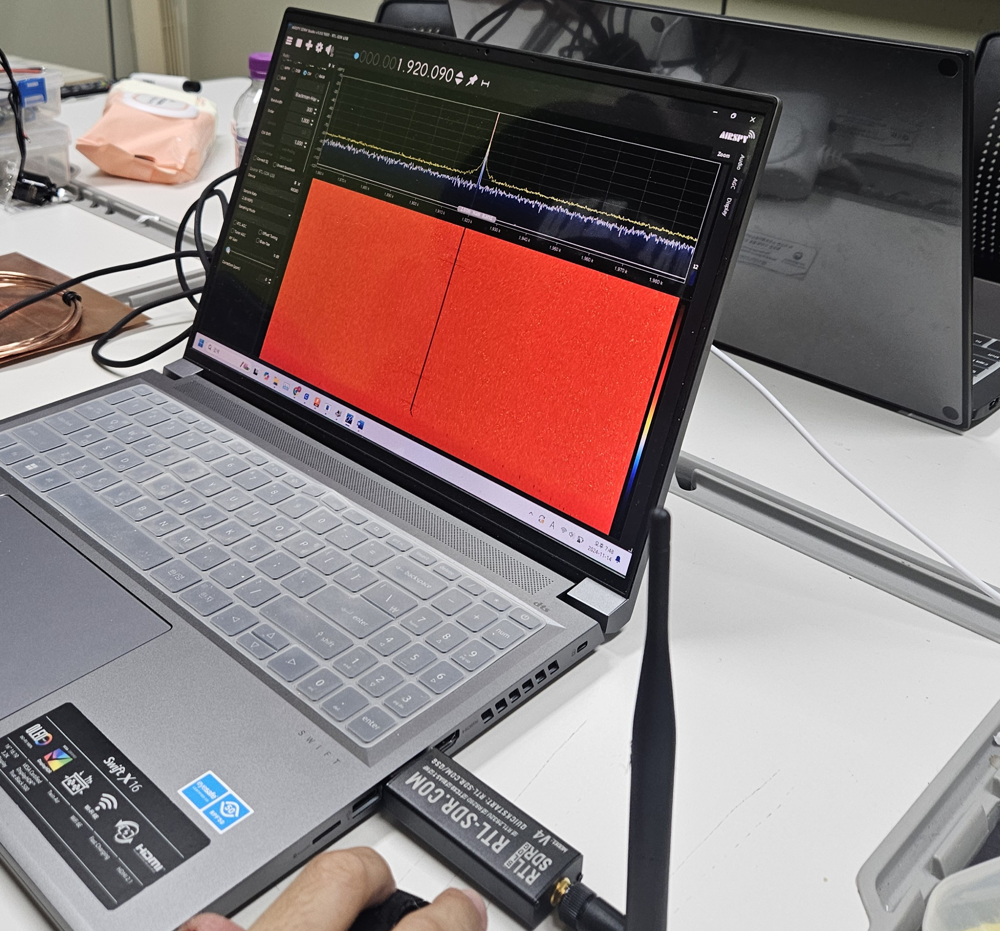

# week10

### 전파 만원경에 필요한 물품 작동 여부 확인 (SDR)

> SDR은 Software Defined Radio를 의미하는데 무선통신 하드웨어, 특히 Chipset 부분에 있어서는 꿈의 개념이다. 즉 Software의 변경만으로 무선규격을 마음대로 바꿔 사용할 수 있는 기술을 의미한다.

> 오늘은 RTL-SDR을 활용하여 Software 기술을 활용하여 다양한 수신기 (AM, DM, DSB, CW등)로 활용할 예정이다.

> 먼저 rtl-sdr 자체 소프트웨어를 사용하여 전파를 잘 수신하는지 확인했다.

>> 현재 사진은 특정 주파수에서 수신되는 라디오를 청취하는 모습을 찍은 사진이다.

> 이후 이를 python으로 응용하여 전파를 실시간으로 받아오는 작업을 진행했다.
>> 1. 현재 시간에서의 전파 수신범위 한 번 나타내기.
>> app.py로 구현했다.
>
>> 2. 실시간으로 rtl-sdr값 받아오기.
>> sequence.py로 구현했다.
