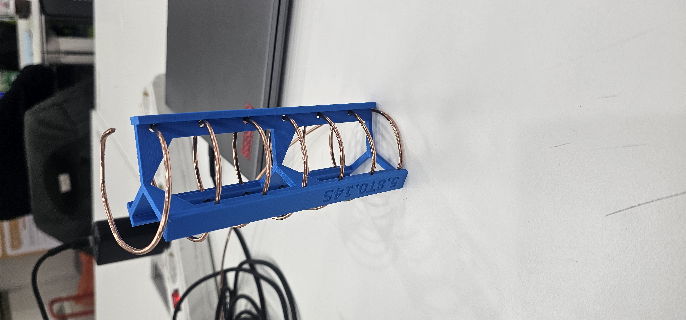
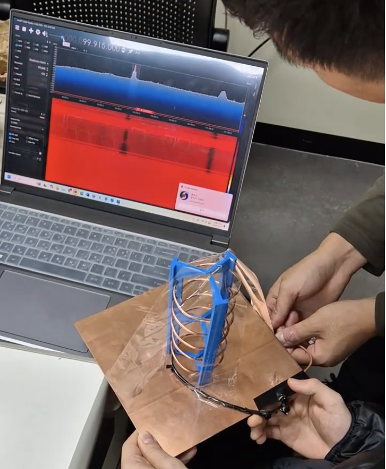

# week11

### 지상 전파 만원경 제작
> 
> 

> 1.4 GHz의 사인파 신호를 사인파 발생기로 생성하고, 이를 SDR로 수신하여 테스트를 진행했다. 

> 테스트 결과, SDR이 1.4 GHz 신호를 수신하는 것을 확인했으나, 다른 주파수에서도 규칙적으로 신호가 검출되는 현상이 발생했다. 

> 이에 대한 원인은 아직 파악하지 못했다. 추가로, 제작한 안테나를 SDR에 연결하여 신호 수신이 가능한지 확인했다.

> 사인파 발생 작동 확인을 위해 만든 코드는 code폴더에 넣어두었다.